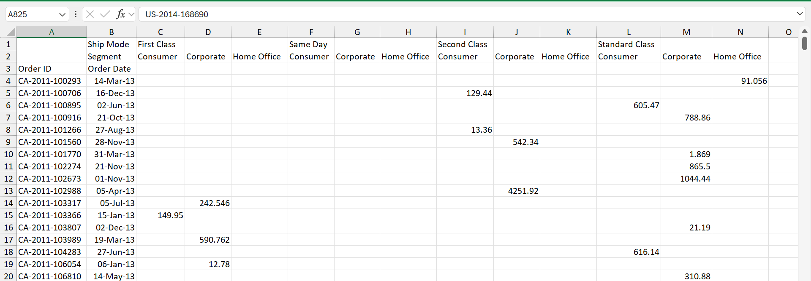
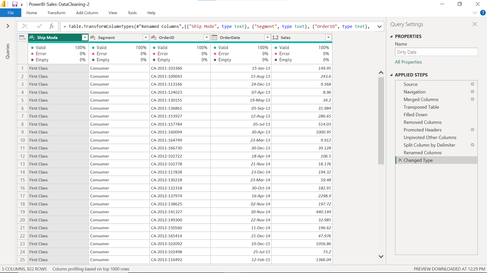
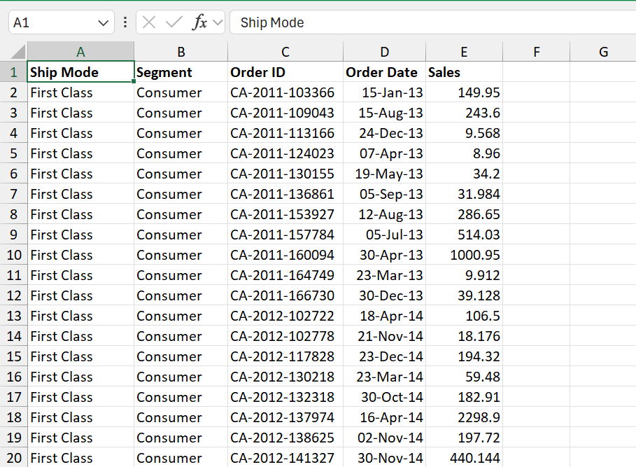

# ✨ From Messy Data to Analysis-Ready Insights

A Power BI Power Query project focused on cleaning, restructuring, and standardizing raw Excel data for analytical use.

---

## 🚀 Project Goal

Raw data is rarely ready for analysis. The purpose of this project was to transform a poorly structured Excel dataset into a clean and organized format that can be used for reporting, dashboarding, and business analysis.

---

## 📸 Project Journey

### 🔴 Before: Raw & Unstructured Data



**Issues Identified**
- Merged cells and headers
- Inconsistent structure
- Data spread across multiple columns
- Non-tabular format
- Difficult to analyze directly

---

### 🟡 Transformation Process in Power Query



**Techniques Applied**
- Merge Columns
- Transpose Table
- Fill Down
- Remove Unnecessary Columns
- Promote Headers
- Unpivot Columns
- Split Columns by Delimiter
- Rename Columns
- Change Data Types

These transformations converted the dataset into a structured format suitable for analysis.

---

### 🟢 After: Clean & Structured Data



**Result**
- Organized tabular structure
- Consistent column names
- Standardized data types
- Improved data quality
- Ready for reporting and visualization

---

## 🛠 Technology Stack

| Tool | Usage |
|--------|--------|
| Excel | Source Data |
| Power BI | Data Processing |
| Power Query | Data Transformation |

---

## 💡 Key Learning Outcomes

- Data Cleaning Best Practices
- Power Query Transformations
- ETL Fundamentals
- Data Reshaping Techniques
- Preparing Data for Business Intelligence

---

## 📈 Business Value

Clean data is the foundation of reliable analytics. By transforming unstructured data into a standardized format, analysts can build accurate reports, create meaningful dashboards, and support better decision-making.

---

## 🏆 Outcome

Successfully converted a messy Excel dataset into a high-quality, analysis-ready dataset using Power Query, demonstrating practical data preparation skills used in real-world analytics projects.

⭐ If you found this project interesting, feel free to explore my other Data Analytics and Power BI projects.
```

